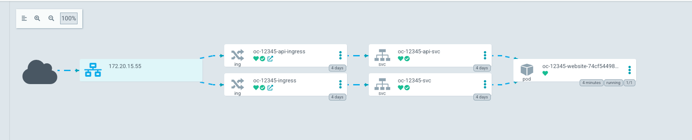
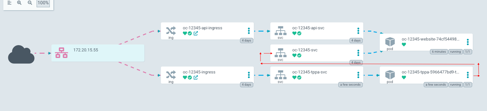

# traffic-pod-autoscaler

A tcp proxy that scales pods to 0 in case of traffic inactivity


## What is it?

This deployment manages a deployment resource. 
It can scale the Deployment all the way down to 0 replica when it is not in use.

To achieve this, TPA (Traffic Pod Autoscaler) is a TCP proxy in front of the target Service This allows the pod to track the number of connections and scale the Deployment to zero when the connection count has been zero for some time period (configurable).

If scaled to zero, an incoming connection triggers a scale-to-one action. Once Service's Endpoints include a "ready" address, the connection can complete, hopefully before the client times out.

Here is a typical deployment:




With TPA enabled, here is the new traffic flow:




## How to use?

You can discover basic example to deploy to use the TPA in the [example](example/) directory

TLDR: use the following config

```
---
apiVersion: apps/v1
kind: Deployment
metadata:
  name: tpa
  labels:
    app.kubernetes.io/name: tpa
spec:
  replicas: 1
  selector:
    matchLabels:
      app.kubernetes.io/name: tpa
  template:
    metadata:
      labels:
        app.kubernetes.io/name: tpa
    spec:
      serviceAccountName: tpa
      containers:
      - name: tpa
        image: opsclub/traffic_pod_autoscaler:latest
        imagePullPolicy: Always
        args:
        - --namespace=my-app
        - --local-port=80
        - --deployment=my-app-deployment
        - --endpoint=my-app-svc
        - --target-address=my-app-svc
        - --target-port=80
        - --expiration-time=600
        - --check-interval=30
        - --max-retry=120
        - --log-level=INFO

        resources:
          requests:
            cpu: 500m
            memory: 512Mi

---
apiVersion: v1
kind: Service
metadata:
  name: tpa-svc
spec:
  type: ClusterIP
  ports:
  - name: http
    protocol: TCP
    port: 80
    targetPort: 80
  selector:
    app.kubernetes.io/name: tpa


---
apiVersion: v1
kind: ServiceAccount
metadata:
  name: tpa

---
kind: Role
apiVersion: rbac.authorization.k8s.io/v1
metadata:
  name: tpa-role
rules:
- apiGroups: ["apps"]
  resources: ["deployments"]
  verbs: ["get", "list", "watch"]
- apiGroups: ["apps"]
  resources: ["deployments", "deployments/scale"]
  verbs: ["patch", "update"]
- apiGroups: [""]
  resources: ["services", "endpoints", "pods"]
  verbs: ["get", "list", "watch"]

---
kind: RoleBinding
apiVersion: rbac.authorization.k8s.io/v1
metadata:
  name: tpa-role-binding
subjects:
- kind: ServiceAccount
  name: tpa
roleRef:
  kind: Role
  name: tpa-role
  apiGroup: rbac.authorization.k8s.io
```
